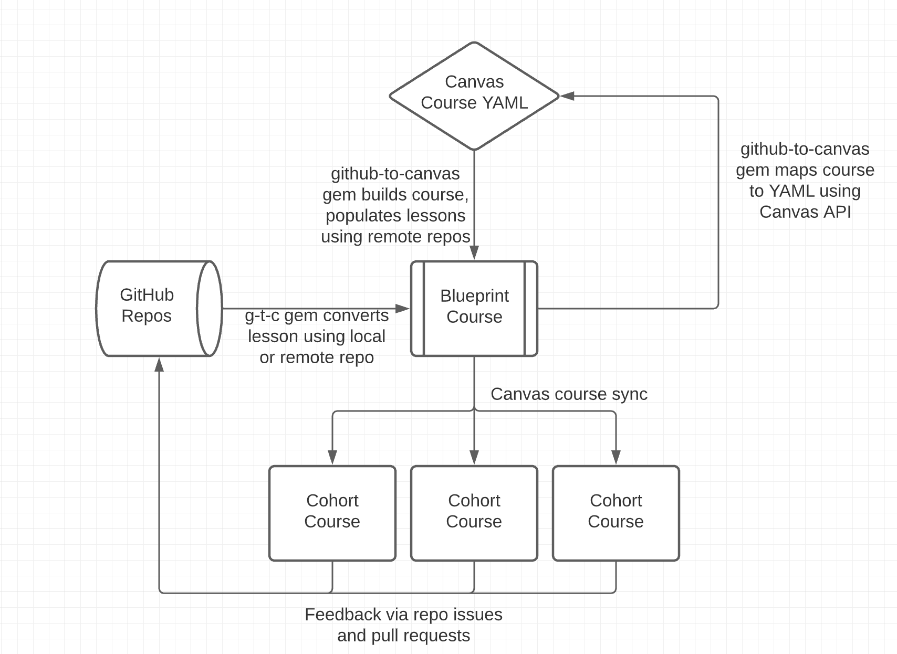

# GitHub to Canvas Gem

## Introduction

The `github-to-canvas` gem is designed to aid in integrating GitHub and the
Canvas LMS. This gem takes a GitHub repository's `README.md` file, converts it
to HTML, and pushes it to Canvas using the Canvas API. This gem can also update
existing Canvas lessons, allowing continuous alignment of content between GitHub
and Canvas.

This gem is built for use internally at [Flatiron School][], so some features may be
specific to Flatiron School branding and needs. Access to the
[Canvas LMS API][] and the ability to add pages and assignments to a Canvas
course are required. Write access to the GitHub repository being converted is
also required for some features.

## Installation

`gem install github-to-canvas`

## Setup

### Generate Canvas API Key

In order to access the Canvas API, you must first generate an API key. Go to
your Canvas Account Settings and under **Approved Integrations**, create a
**New Access Token**. You will need to store this API key as an `ENV` variable
called `CANVAS_API_KEY`.

If you are using Zsh, the following command will add your new key to the top of `~/.zshrc`:

```sh
echo "$(export 'CANVAS_API_KEY=<your-new-API-key-here>' | cat - ~/.zshrc)" > ~/.zshrc
```

If you are using Bash, use this command instead:

```sh
echo "$(export 'CANVAS_API_KEY=<your-new-API-key-here>' | cat - ~/.bash_profile)" > ~/.bash_profile
```

> If you aren't sure which you use, run `echo $SHELL`

### Add Canvas API Base Path

The exact Canvas API path is specific to where your Canvas LMS is located. For example,
Flatiron School's base path is `https://learning.flatironschool.com/api/v1`. Add this path
as an `ENV` variable like the API key. **Do not add a `/` at the end after `/api/v1`.**

```sh
echo "$(export 'CANVAS_API_PATH=<your-base-api-path>' | cat  - ~/.zshrc)" > ~/.zshrc
```

Or for Bash:

```sh
echo "$(export 'CANVAS_API_PATH=<your-base-api-path>' | cat  - ~/.bash_profile)" > ~/.bash_profile
```

After both the API key and path are added to `~/.zshrc`, run `source ~/.zshrc` (`source ~/.bash_profile` for Bash)
to make them available in your current terminal. You can verify these variables
are present by running `ENV` and finding them in the output list.

## Common Uses

The GitHub to Canvas gem can be used for the following:

- [Create a Canvas Lesson from a Local Repository](#create)
- [Create a Canvas Lesson from a Remote Repository](#createremote)
- [Read a Remote Repository as HTML](#read)
- [Update a Canvas Lesson from a Local Repository](#update)
- [Update a Canvas Lesson from a Remote Repository](#updateremote)
- [Retrieve Canvas Course Information as YAML Markdown](#query)
- [Map GitHub Repositories to a Canvas Course YAML file](#map)
- [Create New Canvas Course from a YAML file](#buildcourse)
- [Update Lessons in an Existing Course from a YAML file](#updatecourse)
- [Syntax Highlighting](#syntaxhighlighting)

### Creating and Updating Canvas Lessons

#### Create a Canvas Lesson from a Local Repository <a name="create"></a>

Navigate into a repository folder cloned down to your local machine and run:

```sh
github-to-canvas -c <CANVAS_COURSE_ID> -lr --forkable --solution
```

The command above will create a Canvas lesson in the course provided. It will
also remove the repositories top-level header and remove any old Flatiron
branded footers. It will also add an HTML header for Canvas that includes links
back to the repository.

If the lesson type is an assignment, a Fork button and a Solution will also be added to the
HTML header. Because the command didn't specify, the type of lesson is determined
based on the local repo structure - if it has sub-folders, the lesson will become
an assignment; if there are no sub-folders, the lesson will become a page. If the
lesson type is a page, the `--forkable --solution` options will be ignored.

Creating a lesson this way will also produce a `.canvas` file. This file
contains info about the Canvas lesson that was created.

#### Create a Canvas Lesson from a Remote Repository <a name="createremote"></a>

To create from a remote repo, run the following command:

```sh
github-to-canvas --create-from-github <URL> --course <CANVAS_COURSE_ID> --type <TYPE> -lr --forkable --solution
```

This command will read a GitHub markdown based on the provided URL and create a
Canvas lesson based on it. We need to provide the Course ID and the type of
lesson (`page` or `assignment`) as type can't be determined automatically. We'll
also continue to use `-lr --forkable` like the previous command to set up the
lesson the same way as before.

The repository must be public in order to read the markdown file.

#### Read a Remote Repository as HTML <a name="read"></a>

To read the contents of a remote repo:

```sh
github-to-canvas --read-from-github <URL>
```

This will produce an HTML conversion of the repository's markdown. This HTML can
be directly pasted into Canvas' HTML editor if a manual process is needed.

#### Update a Canvas Lesson from a Local Repository <a name="update"></a>

If you previously created a Canvas lesson from a local repository, you should
have a `.canvas` file present in the repo. If that file is present, you can run
the following command to update the listed Canvas lesson automatically:

```sh
github-to-canvas -a -lr --forkable
```

If you don't have or want to use the `.canvas` file, you can also specify the
course ID and lesson ID:

```sh
github-to-canvas -a --course <CANVAS_COURSE_ID> --id <CANVAS_LESSON_ID> -lr --forkable
```

Canvas course and lesson IDs can be found in the URL.

#### Update a Canvas Lesson from a Remote Repository <a name="updateremote"></a>

You can update an existing Canvas course using a remote GitHub repository like so:

```sh
github-to-canvas --align-from-github <URL> --course <COURSE_ID> --id <LESSON_ID> --type <TYPE> -lr --forkable
```

This will read remote markdown using the provided URL and update a Canvas course
using the info provided. Type must match the existing lesson type.

### Course Creation

This gem can create Canvas courses from scratch. These features
are still in development and may not work for all course designs. Quiz and
Discussion Topic lesson creation is still under development and will not work.

By providing a YAML file of the desired course structure, this gem can create a
course, add in modules, and populate those modules with pages and assignments.
The required YAML file must follow a specific structure. Using the steps below,
this gem can create the necessary YAML markup from existing Canvas courses.

#### Retrieve Canvas Course Information as YAML Markdown <a name="query"></a>

To create YAML markup of an existing Canvas course, use the following:

```sh
github-to-canvas --query <CANVAS_COURSE_ID>
```

This command will use the Canvas API to read a course's information, including
its module and lesson structure and lesson URLs. YAML markup will be produced as a result. This
output can be directly saved to a file, which will make the next step a little
easier:

```sh
github-to-canvas --query <CANVAS_COURSE_ID> > query_results.yml
```

The output will look similar to this:

```yml
---
:name: The Course's Title
:id: 111
:modules:
  - :id: 2020
    :name: First Module's Name
    :lessons:
      - id: slugified-page-name
        title: This is the Title Of The First Lesson, a Page
        indent: 0
        type: Page
        html_url: https://learning.flatironschool.com/courses/111/modules/items/27001
        page_url: slugified-page-name
        url: https://learning.flatironschool.com/api/v1/courses/111/pages/slugified-page-name
        published: false
        repository: ""
      - id: 333
        title: This is the Title Of The Second Lesson, an Assignment
        indent: 1
        type: Assignment
        html_url: https://learning.flatironschool.com/courses/111/modules/items/27002
        page_url: ""
        url: https://learning.flatironschool.com/api/v1/courses/111/assignments/333
        published: false
        repository: ""
  - :id: 2021
    :name: Second Module's Name
    :lessons:
```

The output YAML will not include associated GitHub repository information.

#### Map GitHub Repositories to a Canvas Course YAML file <a name="map"></a>

To associate repositories to an existing course YAML, the following command can be used:

```sh
github-to-canvas --map <YAML_FILE>
```

For this feature to work, all Canvas lessons must have the GitHub HTML header
that is added using `-l`. This header contains the necessary repo information.

Save the output YAML to another file if you want to use it for later course
creation. For example:

```sh
github-to-canvas --map query_results.yml > course_structure.yml
```

The resulting YAML file will contain course information, the module and lesson
structure, and each lesson's associated GitHub repository.

#### Create New Canvas Course from a YAML file <a name="buildcourse"></a>

To create a Canvas course with this gem, you will need a correctly structured
YAML file with the course info, modules, lessons and associated lesson
repositories. In addition, all lessons must have a type (`Page` or
`Assignment`), a repository, and a title. Other lesson options are currently
ignored.

Here's an example of what the YAML file should look like.

```yaml
---
:name: Test Building Course
:course_code: TEST-GEM-COURSE
:modules:
  - :name: Module 1
    :lessons:
      - title: Lesson 1
        type: Assignment
        repository: https://github.com/learn-co-curriculum/react-hooks-component-props-mini-project
      - title: Lesson 2
        type: Page
        repository: https://github.com/learn-co-curriculum/phase-0-pac-1-js-variables
```

With the necessary data configured, use the `--build-course` option and pass in
the course's YAML file:

```sh
github-to-canvas --build-course course_structure.yml -lr --forkable
```

This command will cause the following to happen:

- Create a Canvas course using the top level `:name:` in the YAML data
- Create the first module
- Create the first lesson using the repository, title and type, as well as additional command options
- Add the newly created lesson to the current module
- Create the second lesson and add it to the module...
- Repeat process until all modules and lessons are created

#### Update Lessons in an Existing Course from a YAML file <a name="updatecourse"></a>

The GitHub to Canvas gem can be used to update all lessons in a course
with a single command. To do this, you will need an up-to-date course YAML file with repositories
mapped to each lesson.

```sh
github-to-canvas --query <COURSE_ID> > query_results.yml
github-to-canvas --map query_results.yml > your_new_course.yml
```

Use the resulting file (in this example, `your_new_course.yml`) to update all lessons in
a course based on their GitHub repo:

```sh
github-to-canvas --update-course YAML_FILE -lr --forkable
```

The gem will iterate over the data and update every lesson according to the
associated repository.

## Syntax Highlighting <a name="syntaxhighlighting"></a>

This gem uses the [Rouge](https://github.com/rouge-ruby/rouge) Ruby gem to add
syntax highlighting to
[fenced code blocks](https://www.markdownguide.org/extended-syntax/#syntax-highlighting).
Rouge tokenizes the fenced code blocks and generates HTML elements with CSS
classes to style code blocks. The classes generated by Rouge are intended to
work with [Pygments](https://pygments.org/).

You can download and customize CSS themes for the classes generated by Rouge at this site:

- [http://jwarby.github.io/jekyll-pygments-themes/languages/javascript.html](http://jwarby.github.io/jekyll-pygments-themes/languages/javascript.html)

After selecting your preferred CSS, you will need to
[update your Canvas theme](https://community.canvaslms.com/t5/Admin-Guide/How-do-I-upload-custom-JavaScript-and-CSS-files-to-an-account/ta-p/253)
so the CSS can run on each page.

## Known Issues

### HTML Code Snippets Do Not Render

The Canvas API renders all HTML it receives. If your repository's markdown
includes HTML that is not meant to be rendered, the content will be rendered as
part of the page's HTML, resulting in unusual display errors in Canvas. Examples of
this would be lessons on HTML or JavaScript that include HTML code snippets.

To fix any rendering issues in Canvas, go to the Canvas WYSIWYG editor for the
afflicted lesson. Click the HTML editor option (`</>` button in the lower right) to
switch to HTML.

Read the GitHub repo as HTML:

```sh
github-to-canvas --read-from-github URL
```

Copy the output HTML and paste it into the Canvas editor (if your lesson has a
`<header>` with github links, leave this in). This should clear up some larger
page rendering issues, but may not fix all code snippets issues. To fix these,
switch back to the regular Canvas WYSIWYG editor, then open a second tab to the
GitHub repo you're converting from. Copy any HTML code snippets from GitHub and
paste them into the Canvas editor where they should be displayed.

The Canvas editor will treat the pasted HTML content as code and will
automatically replace some characters, escaping the code from the
normal rendering process.

Note that realigning after fixing this content with the gem will break the
rendering for these lessons again. A fix is planned for this issue, but has not
been implemented.

### Markdown Formatting Issues Cause Errors in Canvas

An empty line should separate individual markdown headers, paragraphs and code snippets
in the markdown. Without these empty lines, the contents will be interpreted as one
continuous paragraph and ignore formatting.

### New Repos That Use a `main` Branch

If you are using a new GitHub repository that uses a `main` branch, you may not be able to
create or update from a remote repository. You can still create and update from a local
repository by using the `--branch` (`-b`) option and specifying `main` as the branch.

A fix is planned for this issue, but not implemented.

## Overview of GitHub to Canvas workflows

Using this gem, you can maintain Canvas courses in multiple ways - either by
creating and updating individual Canvas lessons or through the YAML file process.

At Flatiron School, we use the Canvas blueprint course feature. We use the
github-to-canvas gem to update the blueprint copy of lessons. These updates will appear
in future copies of the course or when synced down associated courses in Canvas.



This can either be done with individual lessons or using a YAML files to keep
entire courses updated.

If you are using github-to-canvas in this way, changes should always be made on
the repository, not on Canvas. Any changes made only on Canvas will get
overwritten if the lesson is updated using the gem.

## Common Options

- `--create-lesson`, `-c`: Requires a Canvas course ID. Creates a new Canvas
  lesson, converting the local repository's README.md to HTML. Adds `.canvas`
  file to remote repository
- `--align`, `-a`: Updates a canvas lesson based on the local repository's
  README.md. If no other options are used, `--align` will look for a `.canvas`
  file to know what to lesson to update
- `--course`: Provide a specific course ID. When used with `--id`, this can
  override the default behavior for `--align`, allowing you to update any
  existing lesson and ignore the `.canvas` file if present.
- `--id`: Provide a specific lesson ID. This can be found in the URL of the
  specific lesson. For Pages, used the slugified lesson title.
- `--type`: Sets the type of Canvas lesson to be created (page, assignment or
  discussion). If no type, type decided based on repository structure.
- `--name`: Can be used to override default naming behavior. By default, Canvas
  lesson names are determined by the first top-level (`#`) header in the
  repository's markdown file.
- `--fis-links`, `-l`: Adds additional Flatiron School HTML header after
  markdown conversion, including links back to the GitHub repo and it's issue
  form.
- `--forkable`: Adds a **Fork** button to the Flatiron School HTML header. For
  use with custom Canvas JS to enable Canvas assignment forking workflow for
  Flatiron School students.
- `--solution`: Adds a **Solution** button to the Flatiron School HTML header. For
  use with custom Canvas JS to provide a link to the solution branch.
- `--remove-header-and-footer`, `-r`: Removes top lesson header and any Flatiron
  School specific footer links before converting to HTML. Removing top lesson
  header prevents duplicate titles while viewing in Canvas.
- `--create-from-github`: Requires a GitHub repository URL. Also requires
  `--course` and `--type`. Creates a Canvas lesson, reading from the remote repo
  instead of a local repository. Repository must be public.
- `--align-from-github`: Requires a GitHub repo URL, `--course`, `--id`, and
  `--type`. Updates a Canvas lesson from a remote repository.
- `--read-from-github`: Requires a GitHub repo URL. Reads a remote repository
  and converts its contents to HTML, but does not push to Canvas.
- `--branch`, `-b`: Can be used when creating or aligning with a local repo to
  specify which branch to use. Use this if you have a new repository that uses a
  `main` branch instead of `master`.
- `--save-to-github`, `-s`: If you are are creating or aligning content locally,
  the `.canvas` file is not automatically committed to the repo. This option will
  attempt to commit and push the `.canvas` file to the remote repository.

Run `github-to-canvas --help` for additional options not listed in this Readme.

## Examples of Valid Images This Gem Can Convert

This gem can convert both standard inline markdown and HTML images.

Inline Markdown:


HTML:

<p align="center">
  
</p>

[canvas lms api]: https://canvas.instructure.com/doc/api/index.html
[flatiron school]: https://flatironschool.com/
